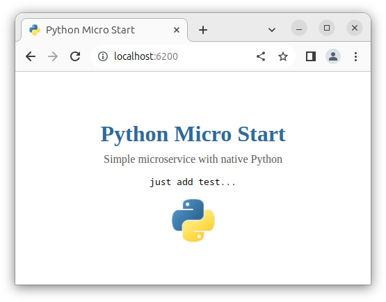

# Micro Start Python

Simple microservice with native Python.

> Feature: uses SimpleHTTPRequestHandler

Based on `python:3.11-alpine3.18`. Built image: `62.9 MB`;
```shell
# run this command to start
make d-up
```

### URL addresses
- main page: `/`
- simple api: `/api`
- static file: `/download/some.txt`

> Just **_click on the logo_** to download a static file.



## Analogs
- Node.js Vanilla: [micro-start-node](https://github.com/phacman/micro-start-node)
- Golang Native: [micro-start-go](https://github.com/phacman/micro-start-go)
- PHP Native: [micro-start-php](https://github.com/phacman/micro-start-php)
